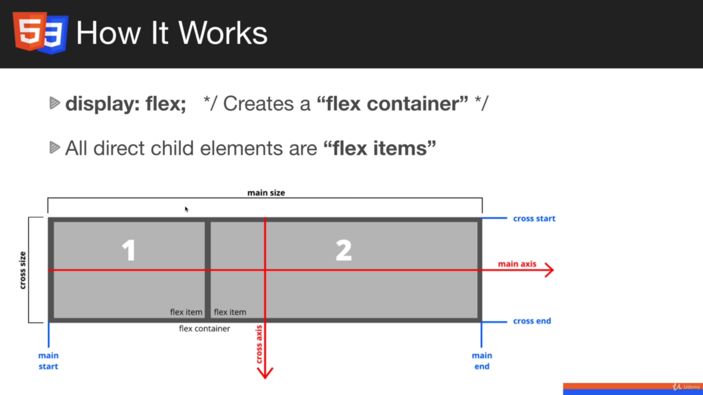
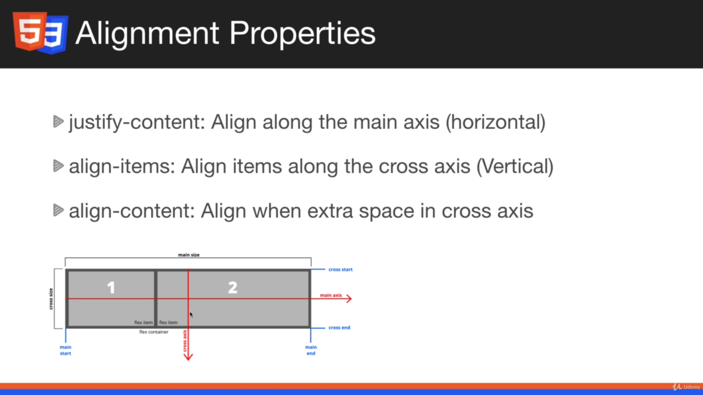

# Flexbox là gì?

- Được ra mắt tại phiên bản CSS3
- flex là giá trị của display
- Thay thế cho float và dễ dàng áp dụng hơn.
- Căn chỉnh phần tử bằng hàng hoặc cột
- Sắp xếp thứ tự phần tử CSS

  

# Các thuộc tính của flex

;

- Justify-content: căn chỉnh theo chiều ngang
- Alighn-items: căn chỉnh theo chiều dọc
- Align-content: căn chỉnh khoảng trống giữ các phần tử
