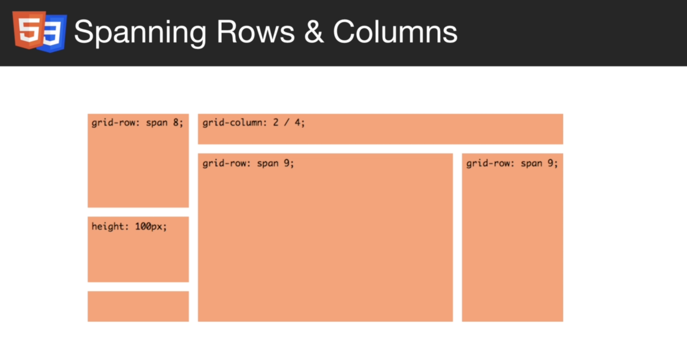

# CSS Grid là gì?

- Hệ thống lưới cho CSS
- Giống như flex nhưng mạnh mẽ hơn.
- Chia bố cục 2 chiều
- Có thể sử dụng align items, justify-content, ...

# Cách sử dụng

- display: grid
- Tất cả phần tử bên trong là grid items
- grid-template-columns để định nghĩa width và số lượng cột
- Grid sử dụng hệ thông 2 chiều

# Grid vs Flex

- Grid sử dụng cho chia bố cục
- Flex sử dụng cho bố cục bên trong như danh sách menu, ...

  
  
